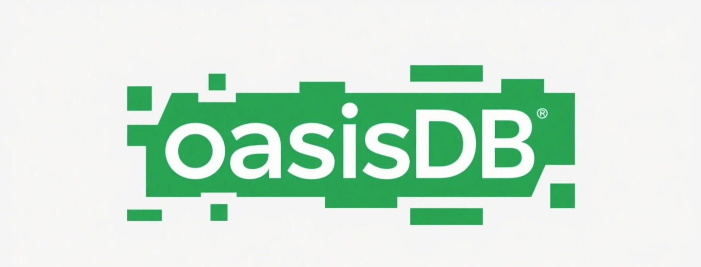
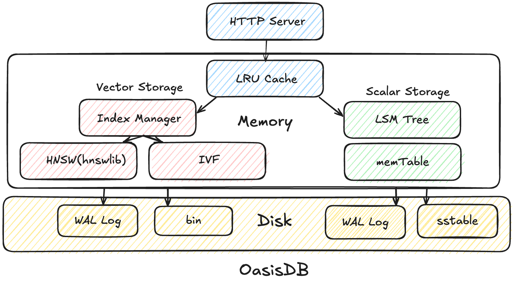

# OasisDB

[](https://coveralls.io/github/lizzy-0323/oasisdb?branch=main)
[](https://opensource.org/licenses/Apache-2.0)
<!--  -->
English | **简体中文**

OasisDB 是一款以易用性为核心的高性能向量数据库。它通过**单进程部署**与 **RESTful API**，为您的应用高效提供向量相似度检索功能。与其他向量数据库相比，OasisDB **没有任何内部网络通信**，因此更加轻量、易于部署。

我创建该项目旨在让初学者能够轻松体验向量检索的全部流程。完整的设计思路与关键知识点，请参阅 [design](docs/design-CN.md)。

## ✨ 功能特点

1. 多种向量索引：HNSW (hnswlib)、IVFFlat， Flat等等
2. 轻量级：单进程独立部署，**无内部网络通信**
3. Embedding 支持：当前支持阿里云向量嵌入服务，详情见 [embedding](docs/embedding.md)
4. 易于使用：提供 HTTP RESTful API 与 Python/Go 客户端 SDK

## 🏗️ 架构



## 🚀 快速开始

### 前置条件

- Go 1.22+
- CMake 3.22+
- Python 3.10+
- uv（可选，用于依赖管理）

### 从源码构建

```bash
make build
./bin/oasisdb
```

### 使用示例

您可以使用 HTTP 请求或 Python 客户端与 OasisDB 交互。以下示例使用 `uv` 安装依赖，并展示最简单的健康检查：

更多用法请参阅 [apidoc](docs/api.md)，或查看示例脚本 [example.py](example.py)。

## 🤝 贡献指南

欢迎任何形式的贡献！在提交代码之前，请先通过 issue 讨论您的想法。

若要提交 PR，请确保通过以下步骤保证代码质量：

```bash
make test
make lint
```

## 📝 许可证

[Apache 2.0](LICENSE)
