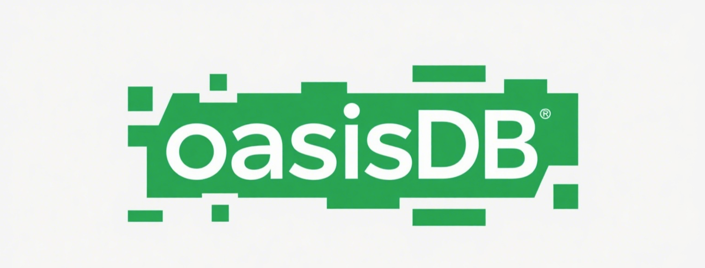

# OasisDB

[](https://coveralls.io/github/lizzy-0323/oasisdb?branch=main)
[](https://opensource.org/licenses/MIT)


<!-- [](https://github.com/lizzy-0323/oasisdb/actions/workflows/push_pr.yml) -->

English | [简体中文](readmd-CN.md)

OasisDB is a lightweight vector database designed for simplicity and ease of use. It enables efficient vector similarity search for your applications like RAG, recommendation system, etc through standalone deployment and RESTful API interfaces.

I start this project for all the beginners like me to learn vector search easily, and you can see all the detail design ideas and related knowledge in [design](docs/设计理念.md).

## Features

1. Multiple type of vector index: HNSW(hnswlib), IVF(faiss) with self-implemented go binding
2. Easy to use: standalone deployment and RESTful API, Python HTTP client
3. Embedding support: multiple embedding models, like OpenAI, Huggingface, etc
4. Minimal dependencies: only go and cmake are required

## Architecture


## Quick Start

### Prerequisites

- Go 1.22+
- CMake 3.22+

### Build from source

```bash
make build
./bin/oasisdb
```

### Usage

You can form http request to send request to oasisdb, or use python http client to send request to oasisdb.

## Contribution

I will be very happy if you can contribute to this project. before contributing, please open an issue to discuss the changes you want to make.

If you want to start a PR for code changes, please follow the steps below to ensure the code quality:

```bash
make lint
make test
```

## License

[MIT License](LICENSE)
