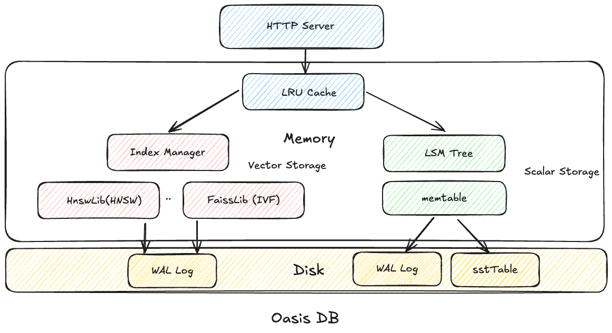

# OasisDB

[](https://coveralls.io/github/lizzy-0323/oasisdb?branch=main)
[](https://opensource.org/licenses/MIT)
<!--  -->

<!-- [](https://github.com/lizzy-0323/oasisdb/actions/workflows/push_pr.yml) -->

English | [简体中文](readme-CN.md)

OasisDB is a high-performance vector database designed for ease of use. It enables efficient vector similarity search for your applications through both standalone deployment and RESTful API interfaces, different from other vector databases, it is **less than 20M**!! And it has no internal network communication, which makes it more lightweight and easier to deploy.

I start this project for all the beginners to learn vector search very easily, and you can see the detail design ideas and related key knowledge in [design](docs/design.md).

## Features

1. Multiple type of vector index: HNSW(hnswlib), IVF(pure Go)
2. Lightweight: standalone deployment as one process, **do not have any internal network communication**.
3. Embedding support: currently support aliyun embedding service, you can refer the embedding docs in [embedding](docs/embedding.md)
4. Easy to use: RESTful API for HTTP and Client SDK for Python

## Architecture



## Quick Start

### Prerequisites

- Go 1.22+
- CMake 3.22+
- Python 3.10+
- uv(optional for package dependencies)

### Build from source

```bash
make build
./bin/oasisdb
```

### Usage

you can use http client to send request to oasisdb, and we choose uv to install python dependencies.

```python
from client import OasisDBClient
client = OasisDBClient()
client.health_check()
```

For more usage, please see [apidoc](docs/api.md),
you can also use [example.py](example.py) to see how to use it.

## Contribution

I welcome any contributions to this project. before contributing, please open an issue to discuss the changes you want to make.

If you want to start a PR for code changes, please follow the steps below to ensure the code quality:

```bash
make test
make lint
```

## License

[MIT License](LICENSE)
